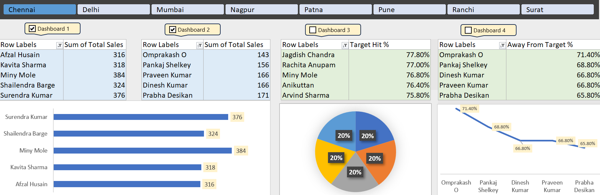

# Sales Performance Dashboard

This project presents a sales performance dashboard built using Microsoft Excel. It tracks and visualizes total sales, target achievement percentages, and gaps from targets for multiple sales representatives across different regions.

## Features
- Total sales breakdown by representative and region
- Target Hit % and Away from Target %
- Visualizations: Bar chart, Line chart, Pie chart
- Interactive region-based analysis tabs

## Tools Used
- Microsoft Excel
- Pivot Tables
- Charts (Bar, Line, Pie)

## Key Insights
- Miny Mole and Surendra Kumar are top performers in total sales.
- Omprakash O is the farthest from hitting the target (71.4% away).
- Jagdish Chandra has the highest Target Hit % (77.8%).

## Dataset
The dataset is self-generated for demonstration purposes and does not represent real individuals or companies.

## Excel Workbook Info

The file `sales_dashboard.xlsx` contains:
- **Sheet 1 – Data**: Self-generated sales data with fields like Name, Region, Sales, and Target.
- **Sheet 2 – Dashboard**: Pivot tables and visualizations tracking performance metrics.

You can view the dashboard image in the `assets/` folder, or open the full Excel file from the `data/` folder.

## Project Structure

- `assets/` – Contains the dashboard screenshot (`Dashboard.png`)
- `data/` – Includes the Excel workbook (`sales_dashboard.xlsx`) with:
  - Sheet 1: Raw sales data
  - Sheet 2: Pivot tables and visualizations
- `README.md` – This file, containing project description and insights.

## Preview

